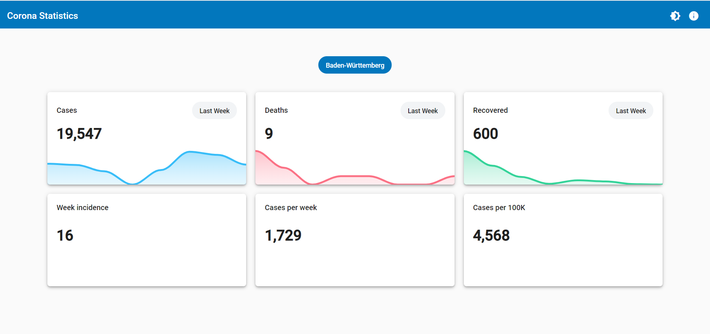

# Dashboard for Corona Statistics in  Germany

[Demo](https://statistics-corona.netlify.app/)

Tech stack:

* Angular
* Angular Material
* [ApexCharts](https://apexcharts.com/docs/angular-charts/)

Data is queried from [rki-covid-api](https://github.com/marlon360/rki-covid-api).

